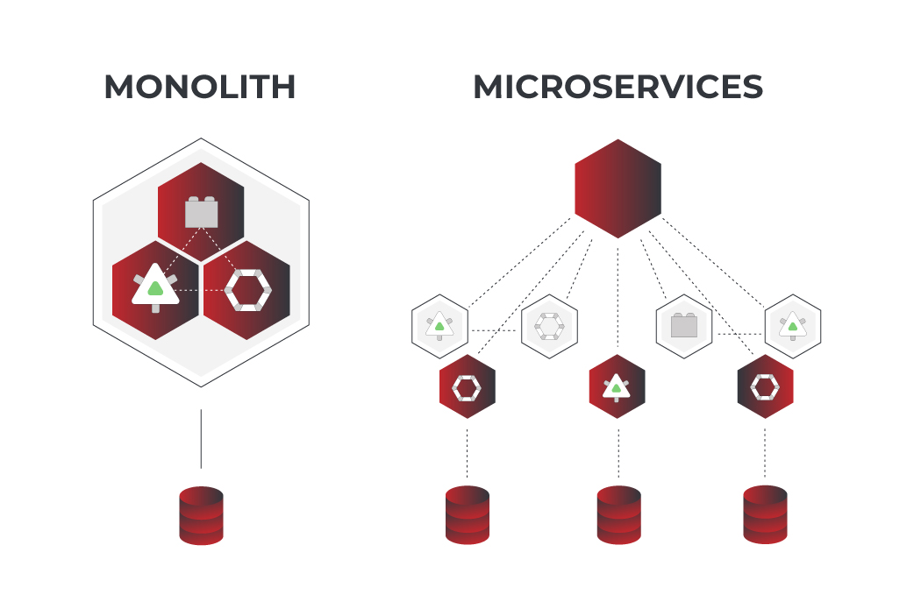
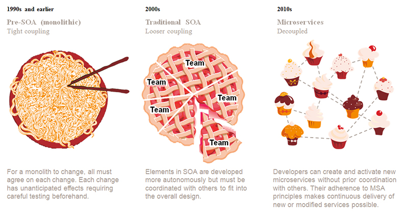

## Hello World
- Name: Orlando Jonathan Padiman
- Student ID: 2702337615
- Class: L4BC

## Architecture
- Monolith
    - All code in one big code base/system.
    - An application where all code is in one single component/file/repository
    - All apps start this way
    - Adv:
        - Easy to develop - Work on only one repository
        - Easy to deploy - Only one application to publish
        - Easy to debug - Only one place to look for bugs
        - Barely any latency
    - Dis:
        - Tends to become really big - Starts to become spaghetti code over time
        - Slow to release new changes - App has to release again every change
        - Bad scaling - When one component needs to be bigger, the entire system has to also be made bigger (Higher cost)
    - Used in:
        - Startups
        - Basic projects
- SOA - Service oriented Architecture
    - Allows users to combine a large number of facilities from existing services to form applications (using APIs[?])
    - Example: Trying to make Gojek, what do you need?
        - Map - Google Map Service
        - Payment Gateway - Paypal
        - Login Service - Google Account Service
    - Adv:
        - Allows reuse of existing components
        - Scalable
        - Resilient
    - Dis:
        - Complex design and implementation
        - More network Traffic
    - Used in:
        - Retail
- Microservice
    - Services run on their own instance.
    - Multiple independent components run alongside each other
    - Each component is in charge of separate functions
    - Each service has their own backend and frontend, independent to one another.
    - Each microservice has its own version and application, separated from other microservices
    - Microservices connect with each other through networks or API
    - Adv:
        - Easier to maintain - When one microservice fails/update, the others can run without any problems as they run independent to the other microservice
        - Flexible - Free to choose whatever tech stack
        - Scalability - If one microservice needs to be scaled due to traffic, it can be done without affecting the entire system, only the one specific microservice needs to be scaled up, saving costs
        - Continuous deployment - When needing to change one component, not at risk of breaking whole program, therefore safe to continuously make changes, tested, and deployed independently 
    - Dis:
        - Difficult to run locally during development - Need to mock up different endpoints
        - Harder to debug - When an issue happens with the program, must diagnose every component and find out what part specifically is wrong
        - Not needed for smaller apps - A lot of unused infrastructure to pay for
    - Used in:
        - Entertainment platforms
        - Ecommerce

## Images

